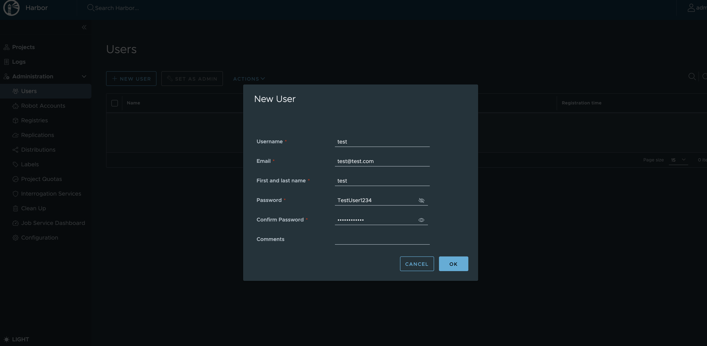
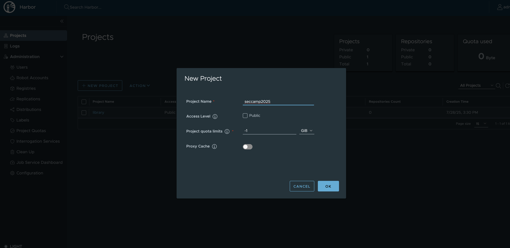
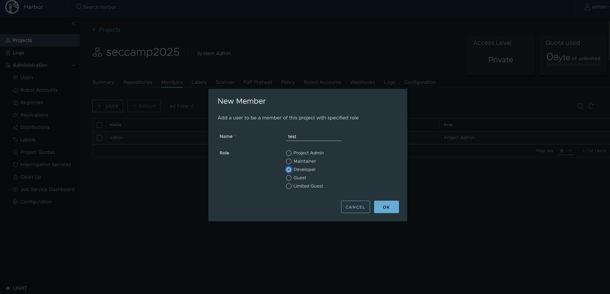
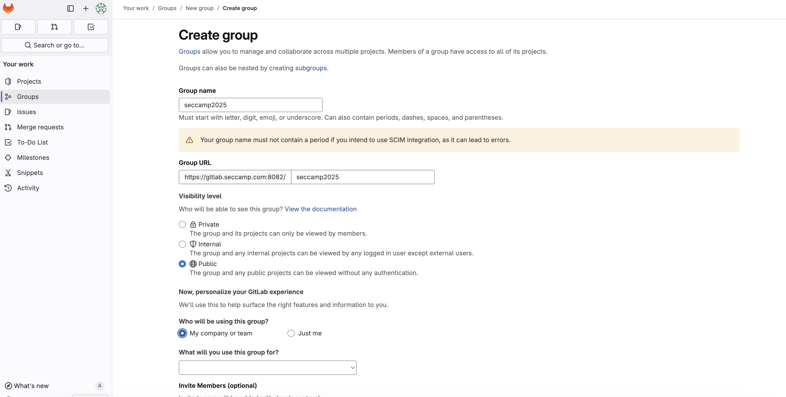
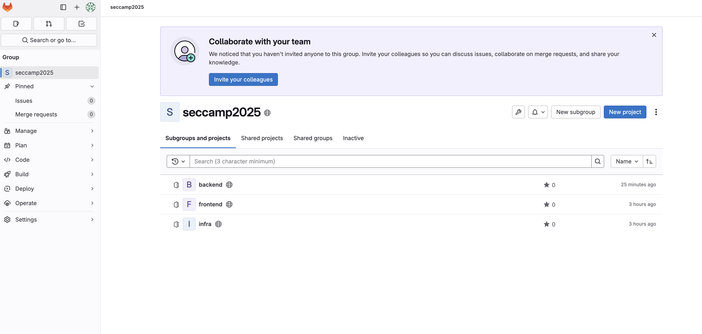
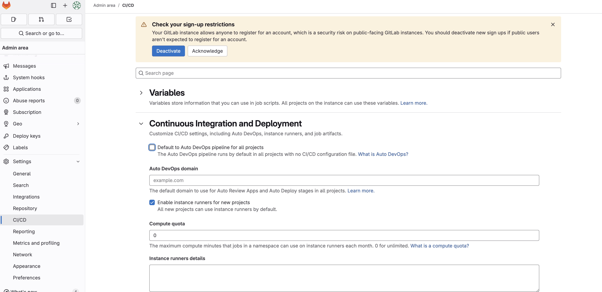
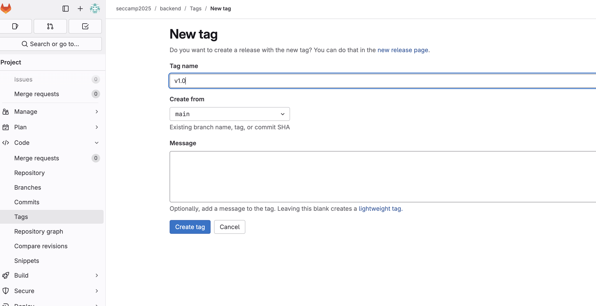

# 環境構築後セットアップ

## 証明書のインストール（自動化済）

```bash
mkdir /usr/local/share/ca-certificates/extra
kubectl view-secret -n cert-manager root-ca-secret ca.crt > /usr/local/share/ca-certificates/extra/seccamp-ca.crt
update-ca-certificates
```

## Harbor

### 管理者でログイン

- username: admin
- password: harboradminpassword

### ユーザー作成

- username: test
- password: TestUser1234
- email: test@test.com



### プロジェクト作成

- project_name: seccamp2025



### プロジェクトにユーザー追加

- Name: test
- Role: Developer



### ImagePullSecrets 作成（自動化済）

```bash
kubectl create secret docker-registry harbor-cred \
  --namespace seccamp-app \
  --docker-server=harbor.seccamp.com \
  --docker-username=test \
  --docker-password=TestUser1234 \
  --docker-email=test@test.com
```

## Gitlab

### 管理者でログイン

- username: root
- password: 以下で取得

```bash
kubectl view-secret -n gitlab gitlab-initial-root-password
```

### グループ作成

- Group name: seccamp2025



### プロジェクト作成

seccamp2025 グループにアプリ用のプロジェクトを作成

- フロントエンド
  - Project name: frontend
- バックエンド
  - Project name: backend
- インフラ
  - Project name: infra



### Auto DevOps 無効化

- Admin コンソールの \[Settings] - \[CI/CD] に移動
- \[Continuous Integration and Deployment] - \[Default to Auto DevOps pipeline for all projects] のチェックを外す
- Save changes で保存



### ソースコード追加

```bash
# git clone from github
cd /root
git clone https://github.com/kyohmizu/seccamp2025-B4.git

# git clone from gitlab
cd /root/gitlab
git clone https://gitlab.seccamp.com/seccamp2025/backend.git
git clone https://gitlab.seccamp.com/seccamp2025/frontend.git
git clone https://gitlab.seccamp.com/seccamp2025/infra.git

# copy code from github to gitlab
cp -r /root/seccamp2025-B4/app/backend/* /root/gitlab/backend/
cp -r /root/seccamp2025-B4/app/backend/.[!.]* /root/gitlab/backend/

cp -r /root/seccamp2025-B4/app/frontend/* /root/gitlab/frontend/
cp -r /root/seccamp2025-B4/app/frontend/.[!.]* /root/gitlab/frontend/

cp -r /root/seccamp2025-B4/app/infra/* /root/gitlab/infra/

# commit & push
cd /root/gitlab/backend
git add .
git commit -m "Import from GitHub"
git push

cd /root/gitlab/frontend
git add .
git commit -m "Import from GitHub"
git push

cd /root/gitlab/infra
git add .
git commit -m "Import from GitHub"
git push
```

### タグの付与

- Projects
  - seccamp2025/backend
  - seccamp2025/frontend
- Tag name: v1.0



## Application

### デプロイ

```bash
kubectl apply -f /root/gitlab/infra/manifests/
```
