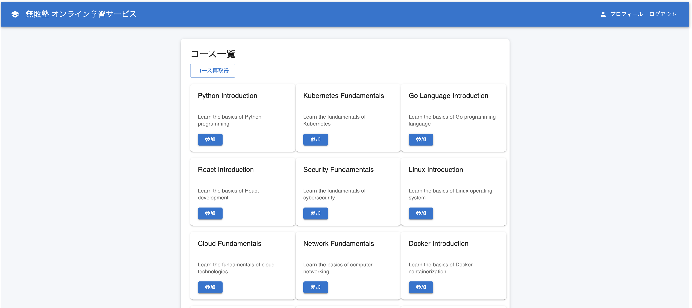

# 1章 シナリオ説明

- [1章 シナリオ説明](#1章-シナリオ説明)
  - [1. シナリオ概要](#1-シナリオ概要)
  - [2. 無敗塾の現在の状況](#2-無敗塾の現在の状況)
    - [2.1 事業の成長と課題](#21-事業の成長と課題)
    - [2.2 システムアーキテクチャ](#22-システムアーキテクチャ)
    - [2.3 アプリケーション機能](#23-アプリケーション機能)
    - [2.4 セキュリティ上の重要データ](#24-セキュリティ上の重要データ)
      - [個人情報](#個人情報)
      - [認証・認可情報](#認証認可情報)
      - [ビジネス機密情報](#ビジネス機密情報)
      - [将来的に扱う予定の法人データ](#将来的に扱う予定の法人データ)
    - [2.5 技術スタック](#25-技術スタック)
    - [2.6 現在のセキュリティ成熟度](#26-現在のセキュリティ成熟度)
  - [3. インフラエンジニアとしての役割](#3-インフラエンジニアとしての役割)
    - [3.1 引き継ぎ状況と前任者のメモ](#31-引き継ぎ状況と前任者のメモ)
  - [4. 組織・チーム体制](#4-組織チーム体制)
  - [5. 演習環境の説明](#5-演習環境の説明)
    - [5.1 提供される環境](#51-提供される環境)
    - [5.2 アクセス情報](#52-アクセス情報)
    - [5.3 前任者からの引き継ぎドキュメント](#53-前任者からの引き継ぎドキュメント)
    - [5.4 トラブルシューティング](#54-トラブルシューティング)
  - [次のステップ](#次のステップ)

## 1. シナリオ概要

皆さんは、株式会社無敗塾（Muhai Juku Inc.）のITインフラ管理部門に新たに配属されたインフラエンジニアです。無敗塾は、学生向けオンライン学習サービス「無敗塾」を主力事業として急成長中のEdTechスタートアップです。

**近年、法人顧客からの引き合いが増加しており、「無敗ラーニング」という法人向けサービスの展開も計画されています。** しかし、法人顧客からは厳格なセキュリティ要件を求められており、現在の「無敗塾」のセキュリティ体制では対応が困難な状況です。

前任のインフラエンジニアが退職することになり、現在はドキュメントベースでの引き継ぎが行われています。経営陣からは「**法人展開に向けて、まずは主力サービスの無敗塾のセキュリティを確実に強化してほしい**」という指示が出ています。

ITインフラの中心にはKubernetesクラスタがあり、「無敗塾」アプリケーションが稼働していますが、これまでは機能実装とスピードを優先してきたため、**セキュリティ対策が後回しになっている**状況です。

皆さんのミッションは、限られた時間とリソースの中で、法人展開に耐えうるセキュリティレベルを実現することです。

## 2. 無敗塾の現在の状況

### 2.1 事業の成長と課題

無敗塾は急速な成長を遂げている学習プラットフォームです。

**無敗塾（学生向け主力サービス）**:
- 創業時からの主力サービス
- 学習管理システム、進捗追跡、成績評価機能
- ユーザー数: 約5万人
- 現在もユーザー数が急増中

**将来計画**:
- **無敗ラーニング（法人向けサービス）**: 来年度の展開を予定
- 法人顧客からの強い要望があり、大きなビジネスチャンス
- ただし、法人顧客は厳格なセキュリティ要件を要求

**経営陣からのメッセージ**:
> 「無敗ラーニングの法人展開は当社の成長戦略の要です。法人顧客は個人向けよりも高いセキュリティレベルを期待しています。現在のプラットフォームでは技術的な不安要素が多すぎます。まず無敗塾の**技術基盤を確実に強化**してください。」

### 2.2 システムアーキテクチャ
```
┌──────────────────────────────────────────────────────┐
│                    外部ユーザー                        │
│              (学生・社会人・法人管理者)                  │
└────────────────────┬─────────────────────────────────┘
                     │ HTTPS
                     │
┌────────────────────┴─────────────────────────────────┐
│                    │              Kubernetes Cluster │
│  ┌─────────────────┴─────────────────────────────┐   │
│  │             Ingress Controller                │   │
│  └─────────────────┬─────────────────────────────┘   │
│                    │ HTTP                            │
│  ┌─────────────────┴─────────────────────────────┐   │
│  │                Frontend                       │   │
│  │              (React/TS)                       │   │
│  └─────────────────┬─────────────────────────────┘   │
│                    │ HTTP API calls                  │
│                    │                                 │
│  ┌───────────────────────────────────────────────┐   │
│  │              Backend API                      │   │
│  │              (Go/Gin)                         │   │
│  └─────────────────┬─────────────────────────────┘   │
│                    │ MySQL queries                   │
│                    │                                 │
│  ┌───────────────────────────────────────────────┐   │
│  │               Database                        │   │
│  │              (MariaDB)                        │   │
│  └───────────────────────────────────────────────┘   │
└──────────────────────────────────────────────────────┘
```

### 2.3 アプリケーション機能

**無敗塾の主要機能**:
- **学習管理システム**: コース管理、進捗追跡、成績評価
- **ユーザー認証**: シンプルなユーザー名・パスワード認証
- **REST API**: Goベースのバックエンドサービス
- **データ管理**: ユーザー情報、学習データ、コース情報
- **管理機能**: 教材アップロード、ユーザー管理、分析ダッシュボード（演習では未実装）



### 2.4 セキュリティ上の重要データ

以下は、無敗塾が扱う機密性の高いデータです。

#### 個人情報
- 学習者の氏名、ユーザー名、パスワード
- 学習履歴、成績データ、進捗情報
- メールアドレス、プロフィール情報

#### 認証・認可情報
- ユーザーパスワード、セッション管理情報
- 管理者権限フラグ、アクセストークン

#### ビジネス機密情報
- 教材コンテンツ、問題・コース情報
- 利用統計、学習データ分析結果

#### 将来的に扱う予定の法人データ
- 企業従業員の個人情報、研修履歴
- 企業別の学習カリキュラム

### 2.5 技術スタック

- **フロントエンド**: React (TypeScript)
- **バックエンド**: Go (Gin framework)
- **データベース**: MariaDB
- **コンテナ**: Docker, Kubernetes
- **CI/CD**: GitLab CI
- **ログ監視**: Loki, Grafana

### 2.6 現在のセキュリティ成熟度

**Level 1 (導入期)**: 急速な成長により、セキュリティ対策が追いついていない状況

- ✅ HTTPSアクセス、基本的なIngress設定
- ✅ 基本的なCI/CDパイプライン構築
- ✅ Kubernetesの監査ログ収集
- ❌ 脆弱性管理なし
- ❌ 実行環境の監視未実施
- etc...

## 3. インフラエンジニアとしての役割

皆さんは無敗塾のインフラエンジニアとして、前任者から引き継いだプラットフォームの管理およびセキュリティ強化を担当します。本講義ではプラットフォームセキュリティに焦点を当て、セキュリティ上の課題を検討・解決していきます。

### 3.1 引き継ぎ状況と前任者のメモ

前任のインフラエンジニアが残した引き継ぎドキュメントには、今後の課題が記載されています。

**前任者からの引き継ぎメモ**:
```
【現状の課題】
無敗塾のセキュリティ体制は最低限の設定しかされていない。
法人利用を想定したセキュリティ設定、運用体制が大幅に不足している状況。

【法人展開への技術的懸念】
- 現在のセキュリティ設定ではサイバー攻撃に十分に対処できない
- アクセス制御が不十分でデータ漏洩リスクが高い
- 異常検知や攻撃監視の仕組みがなく、インシデント発見が困難

【経営陣からのプレッシャー】
「無敗ラーニング展開前に、まず無敗塾を確実に固めてほしい」
「セキュリティは重要だが、サービス停止や開発遅延は避けたい」

【その他コメント】 
「法人顧客は『無敗塾で使っているのと同じ基盤』と聞いている。つまり無敗塾のセキュリティレベルが、そのまま法人展開の可否を決める。責任重大だが、具体的な指針は『業界標準に合わせて』としか言われていない...」
```

## 4. 組織・チーム体制

ITインフラ管理部門は小規模なチームで、急成長する事業を支えています。法人展開に向けたセキュリティ強化への期待が高まっていますが、具体的な指針は少なく、現場の判断に委ねられている状況です。

```
無敗塾 組織図
├── 経営陣 ← 「法人展開前に無敗塾を確実に固めてほしい」
├── ITインフラ管理部門
│   └── インフラエンジニア (3-4名) ← 皆さんの配属先
├── 開発部門
│   ├── 無敗塾チーム (5名) ← 既存サービス
│   └── 無敗ラーニング企画チーム (2名) ← 来年度展開予定
└── 外部パートナー
    └── SaaS、クラウドベンダー
```

**現在のプレッシャー**:
- **経営陣**: 「法人展開のチャンスを逃したくない。セキュリティ基盤をしっかり固めてほしい」
- **開発チーム**: 「セキュリティは重要だが、機能開発のスピードも落としたくない」
- **営業・CS**: 「法人顧客候補から技術的な安全性について質問が多い」

**責任分界点**:
- **インフラ管理部門**: プラットフォーム全体のセキュリティ、インフラ運用
- **開発部門**: アプリケーションコード、ビジネスロジック
- **外部パートナー**: SaaSやクラウドインフラの基盤部分

**セキュリティ体制の現状**:
- **セキュリティ専門人材**: インフラエンジニア（兼セキュリティ担当者）以外にセキュリティを専門に取り扱う人材はいない
- **開発チームのセキュリティ意識**: アプリ開発者はこれまでセキュリティについては特に意識しておらず、機能実装を優先してきた
- **セキュリティ責任の所在**: 
  - アプリケーションの脆弱性修正は開発部門の担当
  - セキュリティを意識した実装の啓蒙や環境整備は、インフラエンジニアの役割
  - 組織全体のセキュリティ文化醸成もインフラ管理部門に期待されている

**課題**:<br/>
セキュリティ強化の方針や優先順位を、限られた情報とリソースの中でインフラチームが自ら決定しなければならない状況。法人展開というビジネスチャンスを成功させるため、「業界標準レベルのセキュリティ」という曖昧な指示のもと、具体的な対策を現場で判断する必要がある。

## 5. 演習環境の説明

### 5.1 提供される環境
演習では、事前に構築された以下の環境を使用します：

- **Kubernetesクラスタ**: EC2上に構築されたkindクラスタ
- **無敗塾アプリケーション**: クラスタ上で動作するWebアプリケーション
- **Gitlab サーバー**: ソースコード、開発パイプラインの管理
- **Harbor レジストリ**: コンテナイメージの管理
- **監視スタック**: Loki, Grafana

環境構築手順

```bash
cd /root/helm/

# 一括適用
helmfile sync

# 特定OSSのみ
helmfile sync --selector app=<appname>
```

### 5.2 アクセス情報

※ ローカル環境から8082→443のポートフォワード設定をしている想定です。

```bash
# アプリケーションURL
https://app.seccamp.com:8082
## ログイン情報
username: sato
password: pass1

# ソースコードリポジトリ
Gitlab: https://gitlab.seccamp.com:8082
## ログイン情報
username: root
password: 以下で取得
kubectl view-secret -n gitlab gitlab-initial-root-password

# コンテナレジストリ
Harbor: https://harbor.seccamp.com:8082
## ログイン情報
username: admin
password: harboradminpassword

# 監視ダッシュボード
Grafana: https://grafana.seccamp.com:8082
## ログイン情報
k view-secret -n monitoring grafana

# その他
ArgoCD: https://argocd.seccamp.com:8082
Hubble: https://hubble.seccamp.com:8082
```

### 5.3 前任者からの引き継ぎドキュメント

演習環境には前任者が残した以下の情報が含まれています。

```bash
# 基本的な環境確認コマンド
kubectl get nodes
kubectl get namespaces
kubectl get pods -A

# 現在稼働中のアプリケーション確認
kubectl get deployments -n seccamp-app
kubectl get services -n seccamp-app
kubectl get configmaps,secrets -n seccamp-app

# 監視システムの状態
kubectl get pods -n monitoring
```

**前任者のメモ（引き継ぎドキュメントより）**:
```
TODO: セキュリティ設定の見直し（法人展開準備）
- 基本的なセキュリティ設定が不十分
- コンテナ・Pod レベルでの適切な制御が未実装
- ネットワークアクセス制御が甘い
- 機密情報の管理方法に問題
- 権限管理・アクセス制御の見直しが必要
- 監査ログや証跡が不十分
- セキュリティ監視体制が未整備

緊急度:高
法人展開のチャンスを逃さないため、法人監査に通るレベルのセキュリティ対策が必要。
ただし開発チームからは「デプロイが複雑になるのは困る」と言われている。

会社からは「法人顧客の要求レベルに合わせて」と言われているが、具体的にどこまでやればいいのか不明。業界標準という曖昧な指示のみ。何かあったらインフラチームの責任になる状況で、判断に迷う。
```

### 5.4 トラブルシューティング

```bash
# Pod状態の確認
kubectl get pods -n seccamp-app -o wide
kubectl describe pod -n seccamp-app <pod-name>
kubectl logs -n seccamp-app <pod-name>

# 現在のユーザー権限確認
kubectl auth whoami
kubectl auth can-i get pods --namespace=seccamp-app

# Service Account確認
kubectl get serviceaccount -n seccamp-app
kubectl describe serviceaccount default -n seccamp-app

# ネットワークの確認
curl -v https://app.seccamp.com
nslookup app.seccamp.com

kubectl get services,ingress -n seccamp-app
kubectl get ingress -n seccamp-app app-frontend-ingress -o yaml
kubectl logs -n ingress-nginx ingress-nginx-controller-b5d5b7c-2n4k4

# リソース使用状況確認
kubectl top nodes
kubectl describe node | grep -A 5 "Allocated resources"
```

---

## 次のステップ

- [演習1 環境の把握](./training.md)
- [2章 クラウドネイティブセキュリティの基礎](../02_cloud_native_sec/README.md)
